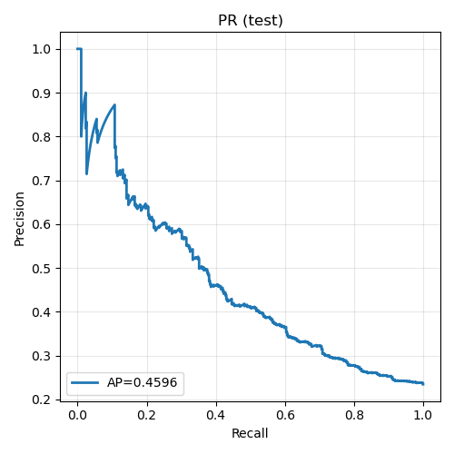
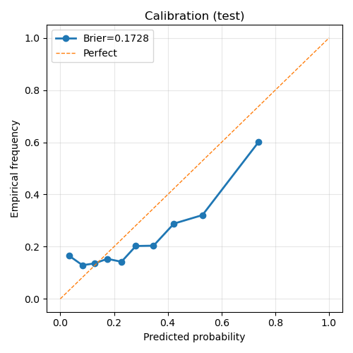

# Interpretable Drug–Drug Interaction Modeling with Heterogeneous Graphs and RAG

A team academic project from Penn State that combines **heterogeneous graph neural networks (GNNs)** with **retrieval-augmented generation (RAG)** to predict potential drug–drug interactions (DDIs) and provide evidence-grounded explanations.

> **Recruiter note:** My primary contribution was **model evaluation and demo development**. I evaluated multiple modeling approaches, reported ROC-AUC / PR-AUC and calibration metrics, analyzed computational efficiency, and developed an interactive demo that connects the trained R-GCN model with an LLM-based literature summary.

## Project Overview

Drug–drug interaction prediction is difficult because interaction risk can depend on broader biological context rather than on an isolated drug pair. This project represents biomedical knowledge as a heterogeneous graph containing **drugs, proteins, and biological pathways**, then uses a **Relational Graph Convolutional Network (R-GCN)** to learn context-aware drug representations.

The system also includes a RAG pipeline that retrieves biomedical literature and produces a concise explanation of potential interaction mechanisms and risks.

### Main components

- **Biomedical data integration** across drug, protein, and pathway sources
- **Heterogeneous graph construction** with multiple node and relation types
- **R-GCN modeling** for DDI prediction
- **Drug-disjoint evaluation** to test generalization to previously unseen drugs
- **RAG-based literature retrieval and summarization** for interpretability
- **Interactive Gradio demo** for selecting two drugs, viewing a model score, molecular structures, and a literature-grounded summary

## My Contribution — Harry Gu

I focused on **evaluation and demonstration development**, including:

- Ran experiments across proposed modeling approaches and reported quantitative metrics such as **ROC-AUC** and **PR-AUC**
- Compared model performance under the established evaluation protocols
- Developed the interactive demo integrating the trained **R-GCN** model with an **LLM/RAG** literature summary
- Added user-facing outputs for DDI scores, drug structures, and interpretation
- Analyzed training/inference efficiency and hardware resource usage
- Supported final performance analysis and presentation of experimental results

My demo code is located in:

```text
team_code/HarryGu/code_submission/demo_app_rgcn.py
```

## Team Contributions

This was a collaborative project. The repository keeps contributor code separated to make ownership clear.

- **Harry Gu** — model evaluation, performance analysis, computational-efficiency analysis, and interactive demo development
- **Nikhil Jain** — biomedical literature retrieval and RAG pipeline
- **Yiting Liu** — heterogeneous graph construction, feature engineering, R-GCN architecture, training pipeline, and evaluation-protocol design

## System Architecture

```text
Drug / Protein / Pathway Data
            |
            v
   Feature Representation
  (molecular + protein + pathway)
            |
            v
 Heterogeneous Biomedical Graph
            |
            v
     Relational GNN (R-GCN)
            |
            v
       DDI Prediction
            |
            +----------------------+
                                   |
Biomedical Literature ---> Retrieval / RAG ---> Evidence-Grounded Summary
```

## Evaluation

A key part of the project was evaluating models under a **strict drug-disjoint split**, where test drugs are not seen during training. This reduces information leakage and better reflects a cold-start scenario involving new or previously unseen drugs.

Selected results from the final report:

| Model setting | PR-AUC | Best F1 | Brier Score |
|---|---:|---:|---:|
| Random split reference | 0.7696 | 0.712 | 0.1258 |
| Drug-disjoint baseline | 0.4370 | 0.448 | 0.1843 |
| Proposed pathway-enhanced R-GCN | **0.4594** | 0.458 | **0.1728** |

The random-split result is shown only as a reference because shared drug identities across train/test can inflate performance. Under the stricter drug-disjoint evaluation, the proposed model improved PR-AUC and calibration relative to the baseline.

### Example evaluation figures

**Precision–Recall curve**



**Calibration analysis**



## Interactive Demo

The Gradio demo allows a user to:

1. Search for two drugs
2. Run the trained R-GCN interaction model
3. View the predicted interaction score
4. Display the molecular structures of both drugs
5. Retrieve and summarize relevant biomedical literature through the RAG component

Main demo entry point:

```bash
python team_code/HarryGu/code_submission/demo_app_rgcn.py
```

## Repository Structure

```text
.
├── README.md
├── requirements.txt
├── .env.example
├── assets/
│   ├── approach6_pr_curve.png
│   └── approach6_calibration.png
├── paper/
│   └── final_report.pdf
└── team_code/
    ├── HarryGu/
    │   └── code_submission/
    ├── Nikhil/
    └── YitingLiu/
        ├── Data_Cleaning/
        └── GNN/
```

Large generated datasets, feature matrices, checkpoints, and local vector-database files are intentionally excluded from the public repository.

## Setup

The project was developed with Python and a combination of PyTorch/PyTorch Geometric, RDKit, Transformers, Weaviate, LangChain, and Gradio.

Create a virtual environment and install the main dependencies:

```bash
python -m venv .venv
source .venv/bin/activate        # macOS / Linux
# .venv\Scripts\activate         # Windows

pip install -r requirements.txt
```

For the RAG component, create a local `.env` file from the example:

```bash
cp .env.example .env
```

Then add your own API key to `.env`:

```text
OPENAI_API_KEY=your_key_here
```

**Never commit `.env` or API keys to a public repository.**

## Data and Reproducibility Notes

The original course project used biomedical resources including DrugBank, ChEMBL, UniProt, STRING, and Reactome. Some datasets and generated artifacts are not included here because of **licensing, size, and reproducibility considerations**.

The public repository is therefore intended primarily as a **code and project showcase**. Reproducing the complete pipeline requires obtaining the underlying datasets from their original sources and rebuilding the generated graph/features/model artifacts.

## Final Report

The full project report is available here:

[`paper/final_report.pdf`](paper/final_report.pdf)

## Disclaimer

This project is for **academic and research purposes only**. Model outputs and generated summaries are not medical advice and should not be used for clinical decision-making.
